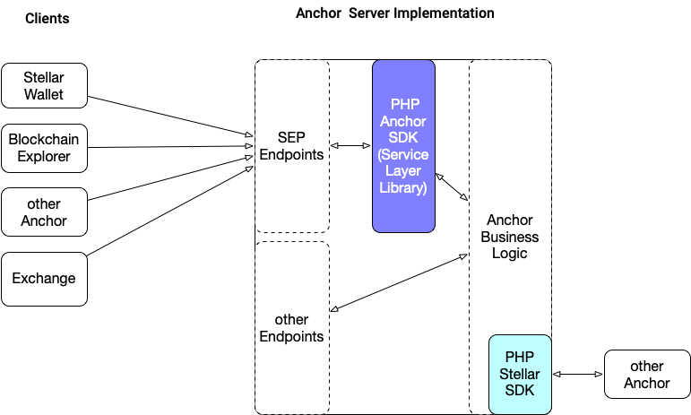
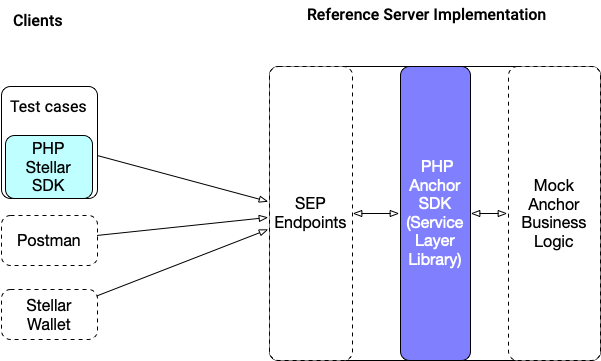

# PHP Anchor SDK Architecture

## Overview

Before starting with the PHP Anchor SDK, let's get familiar with the overall architecture. This section will describe the components involved and how they interact.

## Components

### Clients

The client is an application, such as a wallet or remittance sender, that acts on behalf of a user and makes requests to the system. Stellar clients make requests to the SEP endpoints of the Anchor Server using sets of standards called [SEPs](https://github.com/stellar/stellar-protocol/blob/master/ecosystem/README.md) (Stellar Ecosystem Proposals).

### Anchor Server

The Anchor server is a client-facing server and therefore needs to be accessible from an external network. The Anchor server processes user requests and if they are Stellar SEP related, then it redirects their handling to the integrated PHP Anchor SDK's Service Layer Library. Other requests are handled directly by it's business logic implementation. The Anchor Server only needs to expose endpoints required by the particular SEP it would like to support.

***Service Layer Library (from PHP Anchor SDK))***

The Service Layer Library provided by the PHP Anchor SDK is a library that can be integrated into any PHP Anchor Server implementation. It abstracts the Stellar specific functionality so that Anchor developers can focus on implementing the business logic of the Anchor.

When the library needs to provide information, it doesn't have to the client, such as the exchange rate for an asset pair, it asks the Business-Logic Layer for the needed data. Also, if the library needs to store data, it asks the Business-Logic Layer to do it. The library will never store any sensitive information itself, such as KYC, in the database.

Some SEP's requests are designed for a client to fetch business-related data, such as quotes or fees. Because it's business-driven, the library will request it form the Business-Logic Layer, passing information back to the client. It will also transform the response into a SEP-compliant format.

***Business-Logic Layer***

Finally, the Business-Logic Layer is a layer that the business must implement to fully support most of the SEPs handled by the Service Layer Library. The Business-Logic Layer implements different interfaces defined by the Service Layer to respond to requests from the Service Layer Library (such as requesting a quote for SEP-38). It also provides updates to the library when off-chain events occur (like completing a bank transfer) so that the Service Layer Library can communicate them to the client in a SEP compliant manner.

Furthermore the Business-Logic Layer can integrate our classic [PHP Stellar SDK](https://github.com/Soneso/stellar-php-sdk) to communicate with other Anchors in a SEP compliant way. The classic PHP Stellar SDK provides the client-side abstraction of the Stellar functionality to communicate with Anchors via the needed SEP's.

## Reference implementation

The PHP Anchor SDK also provides a reference implementation that serves as an example project,
demonstrating the interaction with the Service Layer Library. But it can also be easily extended by developers to implement the real business logic.

### Clients 

In the first step, the reference implementation will provide test classes that use the classic [PHP Stellar SDK](https://github.com/Soneso/stellar-php-sdk) to send SEP compliant requests to the Server implementation. In future steps, we plan to also add a Postman collection of SEP requests and a Reference Stellar Wallet for browsers, that provides workflow information, can sign transactions for the user and collect needed data via forms, such as KYC data.

### Server

The reference server will receive SEP compliant requests from the clients and redirect their handling to the integrated PHP Anchor SDK Service Layer Library. The Service Layer Library will interact with the provided Mock Business-Logic to store and receive the needed data. Therefore, the Mock Business-Logic Layer will implement the Interfaces defined by the library so that developers can learn how to integrate the library into their own projects.
